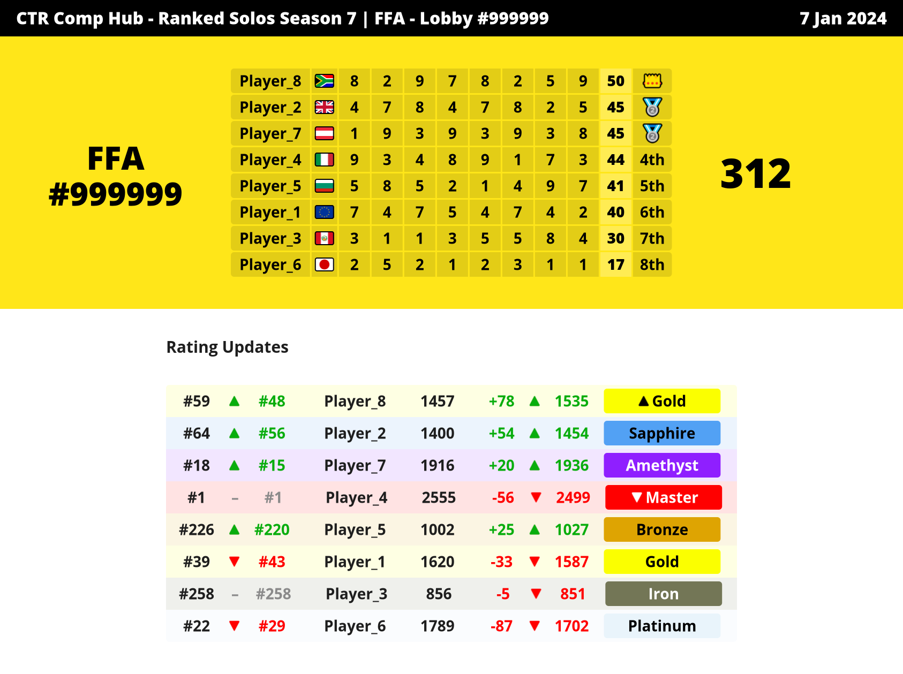

# CTR:NF Scores Calculation Bot

A Discord bot that calculates lobby match results for CTR:NF custom matches.

## Table of Contents
- [Bot setup](#bot-setup)
- [Sending a command](#sending-a-command)
- [Automatic generation of results from the results submissions channel](#automatic-generation-of-results-from-the-results-submissions-channel)
- [How it works](#how-it-works)
- [Table formatting](#table-formatting)
- [Versions](#versions)
- [Website version](#website-version)
- [Discord test server](#discord-test-server)

## Bot setup
See this guide on how to set up the bot: [Bot setup](docs/bot-setup.md)

## Sending a command
1. Go to the discord server to the defined `bot_spam_channel` channel (e.g. `#bot-spam`).
2. Write and send a command:
    ```
    !scores [table]
    ```
    For example:
    ```
   !scores Lobby #999999 - FFA

   Player_1 [eu] 7|4|7|5|4|7|4|2
   Player_2 [gb] 4|7|8|4|7|8|2|5
   Player_3 [pe] 3|1|1|3|5|5|8|4
   Player_4 [it] 9|3|4|8|9|1|7|3
   Player_5 [bg] 5|8|5|2|1|4|9|7
   Player_6 [jp] 2|5|2|1|2|3|1|1
   Player_7 [at] 1|9|3|9|3|9|3|8
   Player_8 [za] 8|2|9|7|8|2|5|9
    ```

3. Bot sends a PNG image containing results.

    

## Automatic generation of results from the results submissions channel
1. Go to the discord server to the defined `ranked_results_submissions_channel` channel (e.g. `#results-submissions`).
2. Post a results submission message
    ```
    [table]
    ```
   For example:
    ```
   Lobby #999999 - FFA

   Player_1 [eu] 7|4|7|5|4|7|4|2
   Player_2 [gb] 4|7|8|4|7|8|2|5
   Player_3 [pe] 3|1|1|3|5|5|8|4
   Player_4 [it] 9|3|4|8|9|1|7|3
   Player_5 [bg] 5|8|5|2|1|4|9|7
   Player_6 [jp] 2|5|2|1|2|3|1|1
   Player_7 [at] 1|9|3|9|3|9|3|8
   Player_8 [za] 8|2|9|7|8|2|5|9
    ```

3. Bot sends you a reply in the `ranked_results_submissions_channel` with a link to the generated PNG results (in the `ranked_results_channel`).

## How it works

1. Valid and finished CTR:NF match results (table template) are parsed by the discord command.
2. Based on the table template header `Lobby <number> - <Lobby Type>` the right CTR:NF board is fetched.
3. Calculating scores
    - If the match was already submitted on the official leaderboard, the submitted match results will be returned instead.
    - If the match is not yet submitted, it calculates results for the table template match based on the leaderboard matches and all previous unsubmitted results from the `ranked_results_submissions_channel` channel.

## Table formatting
For detailed information about table formatting, check out the [Table Formatting](docs/table-formatting.md).

## Versions
Works with discord.js v12 and discord.js v14.

**Branches:**
- discord.js v12 = [feature/discord-v12](https://github.com/lukask9412/ctrnf-scores-calculation-bot/tree/feature/discord-v12)
- discord.js v14 = [main](https://github.com/lukask9412/ctrnf-scores-calculation-bot)

## Website version
https://ctrlobbies.com/

## Discord test server
https://discord.gg/J65jqHpj
